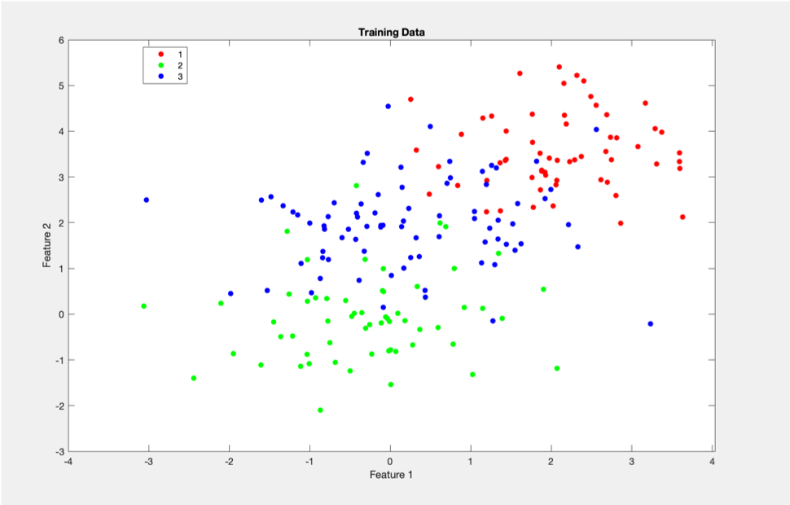
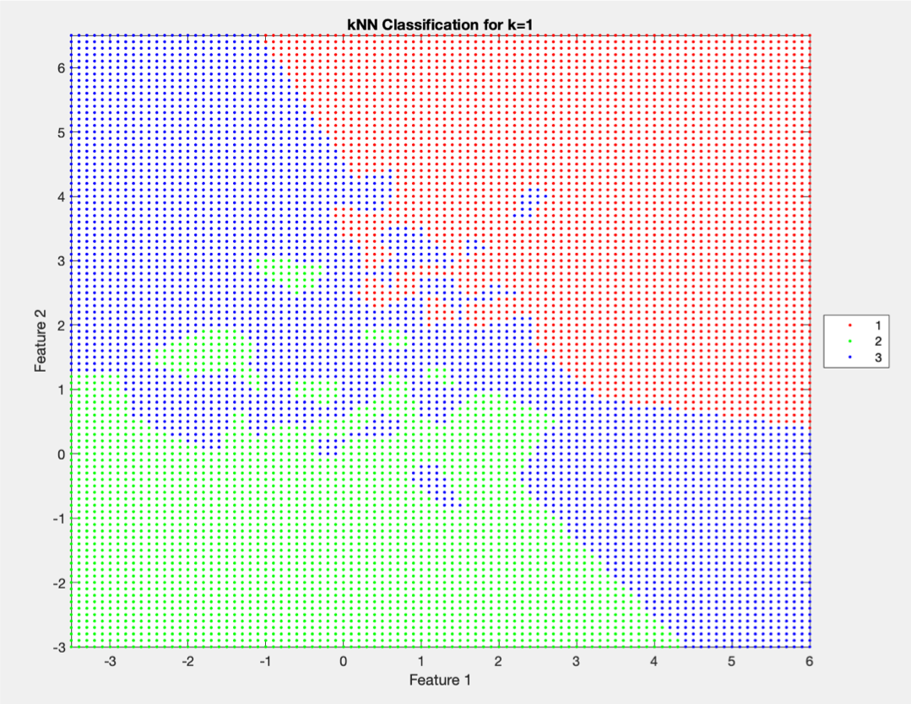
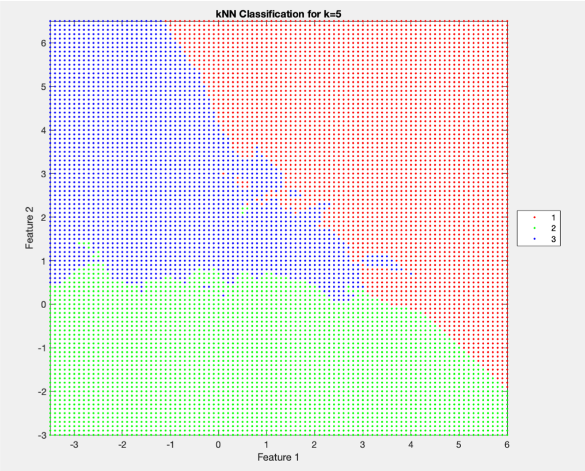

# Machine Learning 

Algorithms of Classic Machine Learning Problems Using MATLAB

No Machine Learning Packages used

All Self-Written Source Codes from Scratch.

# Topics Included:

```
- Nearest Neighbor Methods (KNN Classification/Regression)

- Clustering (K-Centers, DP-Centers)

- Linear Methods:
  - LDA and Ridge Regression
  - Logistic Regression (SGD)
  - Support Vector Machine (SSGD)
  
- Dimensionality Reduction using PCA

- Kernel for SVM & Clustering

```

# Classification

## K-Nearest Neighbors Algorithm

Training Dataset:



Predictions By KNN Algorithm:




## Logistic Regression using Stochastic Gradient Descent Algorithm

Training Dataset: 3 Classes, Features in R^4


