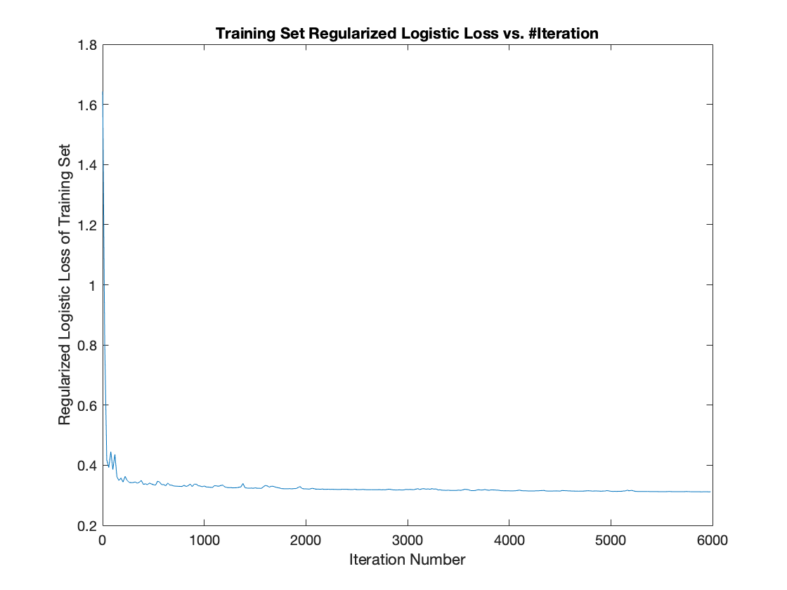
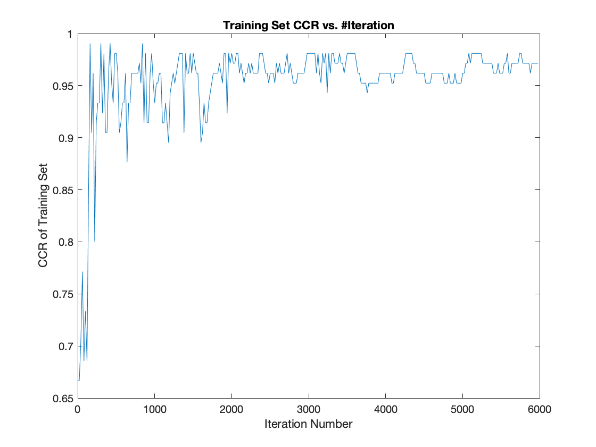
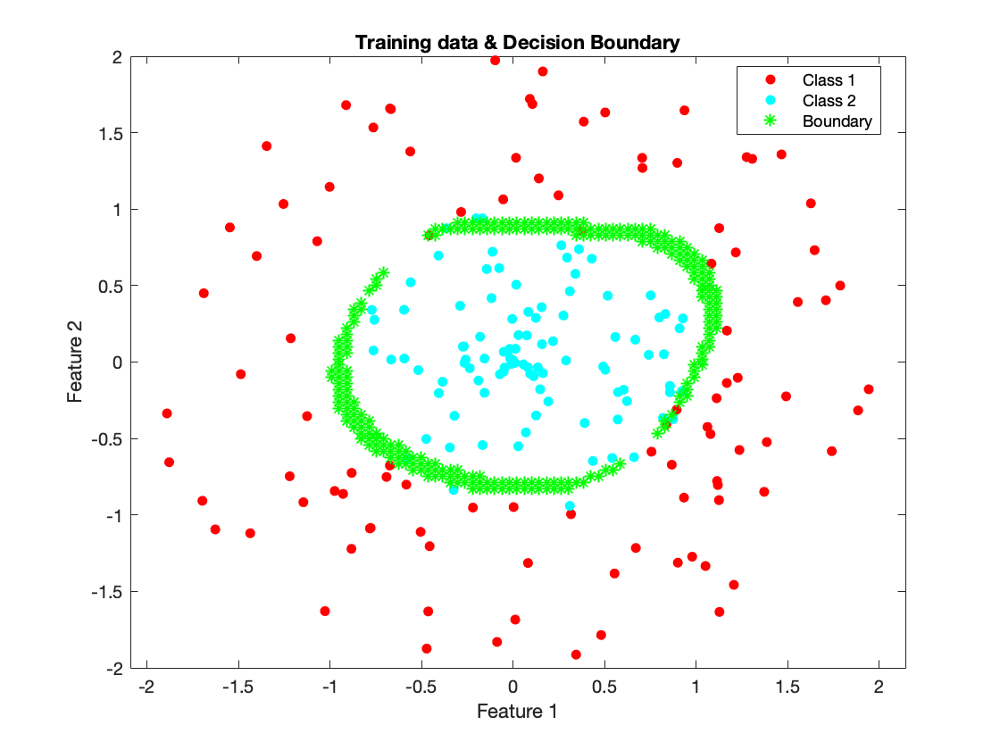
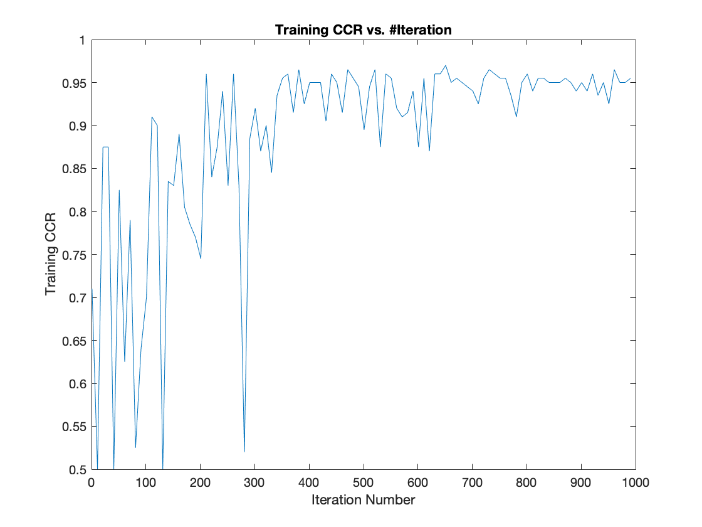
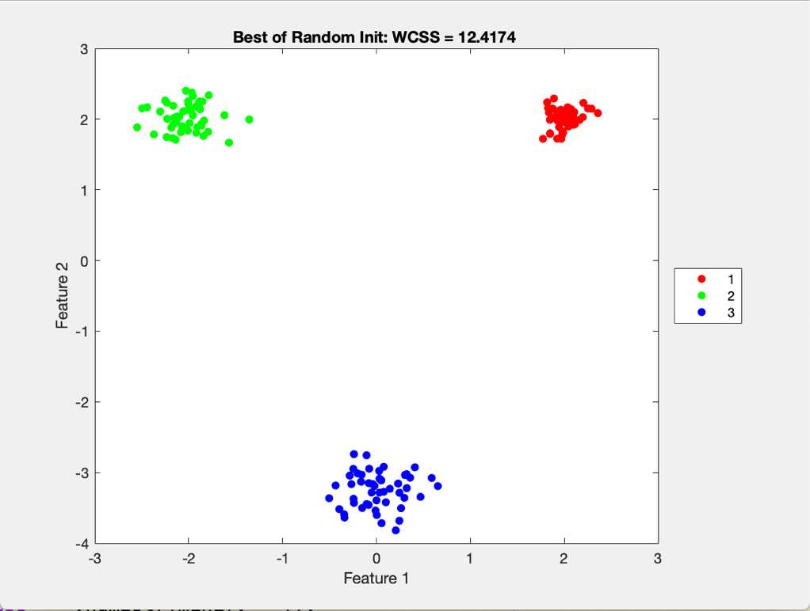
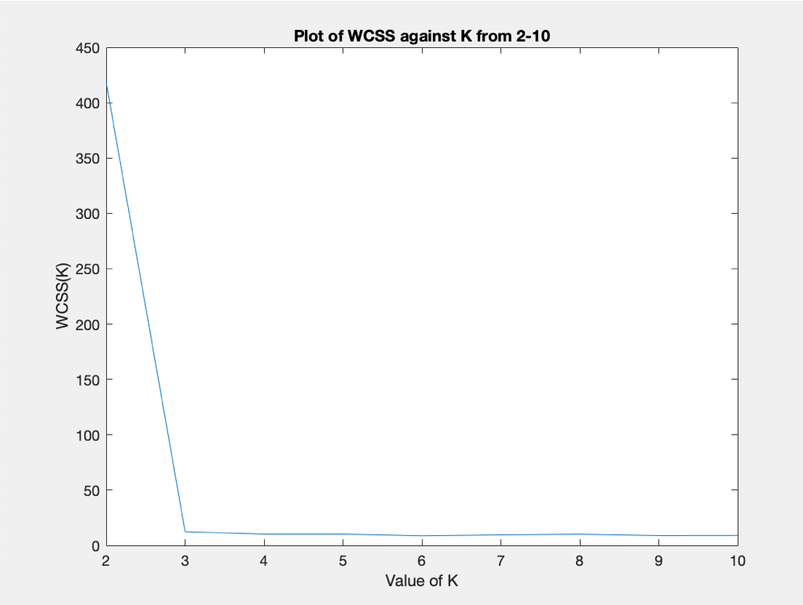
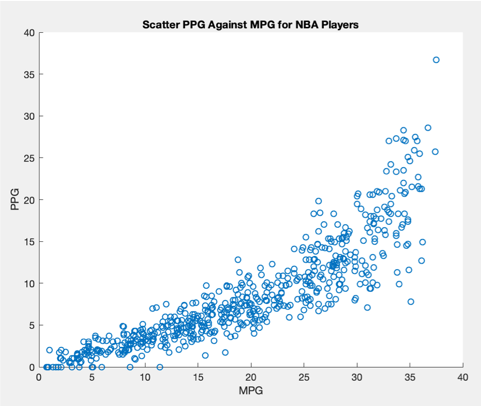

# Machine Learning 

Algorithms of Classic Machine Learning Problems Using MATLAB

No Machine Learning Packages used

All Self-Written Source Codes from Scratch.

# Topics Included:

```
- Nearest Neighbor Methods (KNN Classification/Regression)

- Clustering (K-Centers, DP-Centers)

- Linear Methods:
  - LDA and Ridge Regression
  - Logistic Regression (SGD)
  - Support Vector Machine (SSGD)
  
- Dimensionality Reduction using PCA

- Kernel for SVM & Clustering

```

# Classification

## Logistic Regression & Stochastic Gradient Descent Algorithm

Training Dataset: 3 Classes, Features in R^4


SGD Algorithm Learning Progress over Iterations:




## Binary-SVM with RBF Kernel

Training Dataset & Outcome Decision Boundary:



SSGD Algorithm Learning Progress over Iterations:




## K-Nearest Neighbors Algorithm

Training Dataset:


Predictions By KNN Algorithm:


# Clustering

## K-Means Algorithm

Clustering Outcome: K = 3



WCSS Analysis:



## DP-Centers Algorithm

NBA 18-19 MPG vs. PPG Dataset:



Clustering Outcome: Lambda = 44


# Dimensionality Reduction

## PCA


